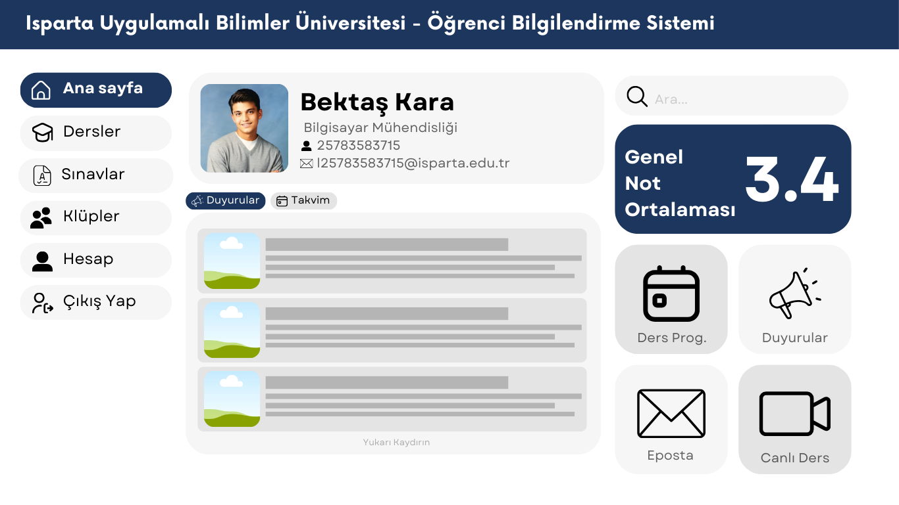
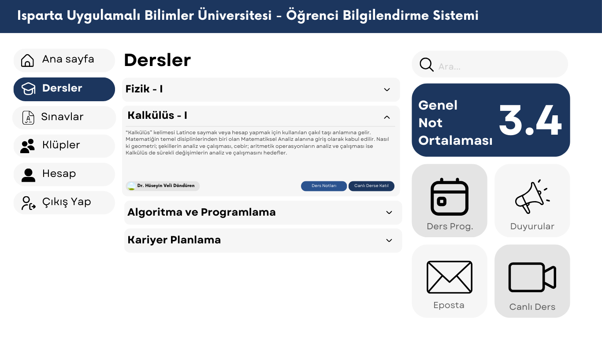

# Öğrenci Bilgi Sistemi Tasarımı

## Proje Hakkında
Merhabalar! Üniversite sonuçları belli olduğunda Isparta Uygulamalı Bilimler Üniversitesi Bilgisayar Mühendisliği'ni kazanmıştım. OBS, yani Öğrenci Bilgi Sistemi'ne giriş yaptığımda bir şok geçirdim; sistemi yapan kişinin CSS’den haberi yok diye yorumladım :D. Sistemin tasarımı salt metinden oluşuyordu, bu durum her şeyin yerinin karışmasına ve okunurluğun azalmasına yol açıyordu. Bende bu tasarımı daha göze hitap eden bir şekilde yenilemeyi düşündüm. Taslak tasarımları bana daha kolay geldiği için Canva ile yaptım; React ile de UX deneyimi iyi olan bir arabirim geliştireceğim.
## Proje Taslak Resimleri

(Görsel 1.1) Ana sayfanın sol tarafında menü bulunuyor, sağ tarafta ise uygulamalar ve gno bilgisi yer alıyor. En üst kısımda kullanıcı bilgilerini gösteren bir alan mevcut. Orta bölümde ise sekmeli bir menü (tab menu) kullanıldı; böylece hem duyurulara hem de takvime tek bir sayfa üzerinden kolayca erişilebiliyor. Ekstra bir sayfaya geçmeye gerek kalmadı.

(Görsel 1.2) Dersler sayfasında accordion kullanrak gereksiz bilgi kirliliği ortadan kaldırıldı.

### Önemli bilgi
Proje taslak tasarımları hala geliştiriliyor, önerilerinizi ve yorumlarınızı bekliyorum <3