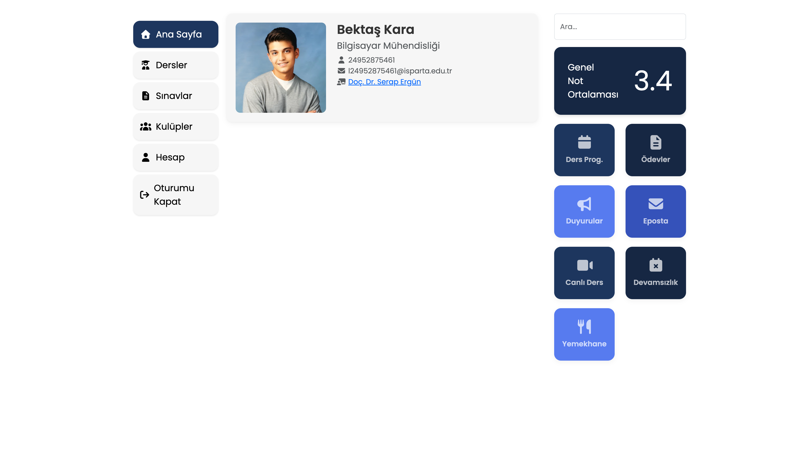
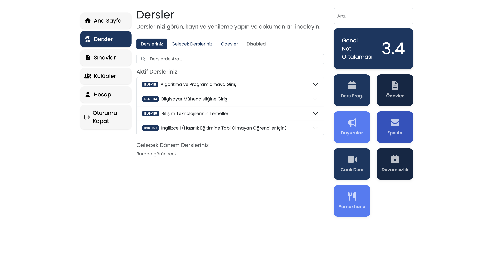

# 🎓 Öğrenci Bilgi Sistemi Tasarımı

## 🚀 Canlı Demo
**Bu projenin canlı yayındaki demosuna aşağıdaki adresten inceleyebilirsiniz:**
[isubu-obs Canlı Demo](https://isubu-obs.vercel.app/)

## 💻 Proje Hakkında
Merhabalar! Üniversite sonuçları belli olduğunda Isparta Uygulamalı Bilimler Üniversitesi Bilgisayar Mühendisliği'ni kazanmıştım. OBS, yani Öğrenci Bilgi Sistemi'ne giriş yaptığımda bir şok geçirdim; sistemi yapan kişinin CSS’den haberi yok diye yorumladım :D. Sistemin tasarımı salt metinden oluşuyordu, bu durum her şeyin yerinin karışmasına ve okunurluğun azalmasına yol açıyordu. Bende bu tasarımı daha göze hitap eden bir şekilde yenilemeyi düşündüm. Taslak tasarımları bana daha kolay geldiği için Canva ile yaptım; React ile de UX deneyimi iyi olan bir arabirim geliştireceğim.

---

## 🖼️ Proje Resimleri




---
## Nasıl Kullanılır

1. **Projeyi Klonlayın**
```
git clone https://github.com/bektaskraa/isubu-obs
cd isubu-obs
```

2. **Gerekli Bağımlılıkları Kurun**

```
npm install
```

3. **Projeyi Çalıştırın**
   Local ortamda başlatmak için:

```
npm run dev
```


4. **Tarayıcıda Görüntüleyin**

```
http://localhost:5173/
```

---

### 🛠️ Kullanılan Teknolojiler

Bu projede aşağıdaki teknolojiler ve kütüphaneler kullanılmıştır:

* **React:** Kullanıcı arayüzünü oluşturmak için tercih edilen ana kütüphane.
* **React Router DOM:** Uygulama içindeki sayfa yönlendirmelerini yönetmek için kullanıldı.
* **Font Awesome:** Tasarımda kullanılan tüm ikonları sağlamak için entegre edildi.
* **Canva:** Projenin taslak ve görsel konseptlerinin oluşturulduğu tasarım aracı.
* **Modern CSS:** Esnek kutu modeli (Flexbox) ve CSS değişkenleri (CSS Variables) gibi özellikler kullanılarak temiz ve yönetilebilir stil kodları yazıldı.

---

### 💡 Önemli Bilgi
Proje hala geliştiriliyor, önerilerinizi ve yorumlarınızı bekliyorum <3